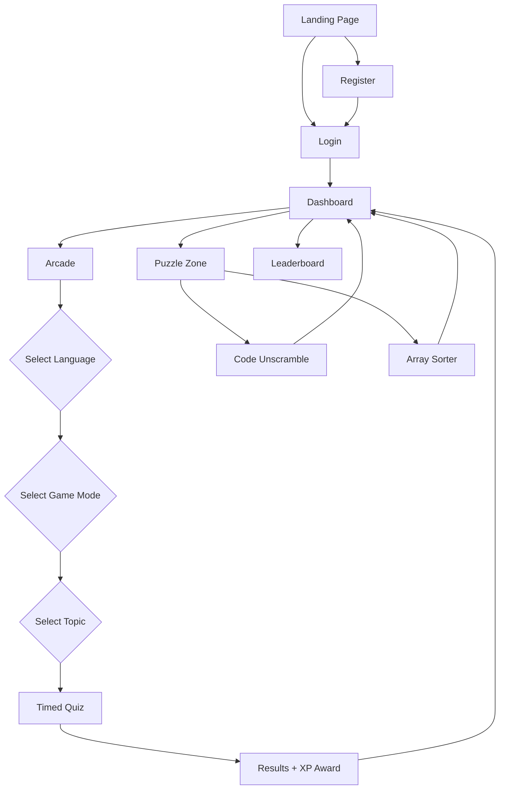

<p align="center">
  
</p>

<h1 align="center">🌊 Wisdom Wave</h1>

<p align="center">
  <strong>Master coding through real-world challenges, structured learning paths, and instant feedback — at your own pace.</strong>
</p>

<p align="center">
  
  
  
  
  
</p>

---

## 📖 Table of Contents

- [About](#-about)
- [Features](#-features)
- [Screenshots & UI](#-screenshots--ui)
- [Tech Stack](#-tech-stack)
- [Project Structure](#-project-structure)
- [Getting Started](#-getting-started)
- [Firebase Setup](#-firebase-setup)
- [Available Scripts](#-available-scripts)
- [Game Modes](#-game-modes)
- [Supported Languages](#-supported-languages)
- [XP & Progression System](#-xp--progression-system)
- [Architecture Overview](#-architecture-overview)
- [Contributing](#-contributing)
- [License](#-license)

---

## 🧠 About

**Wisdom Wave** is a gamified, interactive coding quiz and puzzle platform designed to help developers — from beginners to intermediate — sharpen their programming skills across multiple languages. The platform transforms dry DSA and OOP theory into engaging, timed challenges with XP rewards, daily streaks, leaderboards, and real-time progress tracking.

> _"Learn · Build · Ship"_ — The Wisdom Wave philosophy.

---

## ✨ Features

### 🎮 Core Learning
- **Arcade Mode** — Choose a language → select a game mode → pick a topic → solve timed quizzes and earn XP.
- **Puzzle Zone** — Two unique puzzle types: **Code Unscramble** (rearrange tokens) and **Array Sorter** (drag-and-drop sorting).
- **4 Game Modes** — MCQ Challenge, Output Guess, Bug Finder, and Fill in the Blank — each with different XP multipliers.
- **10,000+ Questions** — Across 11 programming languages and 40+ topics per language, covering DSA and OOPs.

### 📊 Gamification & Progression
- **XP System** — Earn XP for every correct answer. Harder modes yield higher XP multipliers (1x → 2x).
- **Leveling** — XP-based leveling system with animated progress bars and level badges.
- **Daily Streaks** — Login daily to maintain your streak and earn bonus XP (up to +150 XP/day).
- **Daily Quests** — Complete puzzles, maintain streaks, and win battles for bonus rewards.
- **Leaderboard** — Real-time global leaderboard ranked by total XP.
- **Activity Feed** — Track your recent completions, quiz results, and XP gains.
- **Module Progress** — Visual progress tracking for every language and topic.

### 🎨 UI/UX
- **Dark Glassmorphic Design** — Premium dark theme with ambient glow orbs, subtle grid patterns, and smooth animations.
- **Custom Cursor** — Interactive custom cursor with hover effects across all pages.
- **Responsive Layout** — Fully responsive from desktop to mobile.
- **Cinematic Landing Page** — Background video, floating tech keywords, gradient typography, and animated CTAs.
- **Streak Toast Notifications** — Animated toast popups celebrating streak milestones with XP bonus display.
- **Interactive Demo** — Built-in step-by-step "How to Play" walkthrough for puzzle modes.

### 🔐 Authentication
- **Firebase Auth** — Email/password registration and login with form validation.
- **Protected Routes** — Dashboard, Arcade, and Puzzle pages require authentication.
- **User Profiles** — Automatic Firestore user documents with XP, level, streak, and activity data.

---

## 🛠 Tech Stack

| Layer | Technology | Purpose |
|-------|-----------|---------|
| **Frontend** | React 19 + TypeScript | Component-based UI with type safety |
| **Build Tool** | Vite 8 | Lightning-fast HMR and optimized builds |
| **Styling** | Tailwind CSS 4 + Inline Styles | Utility classes + custom inline styles for premium UI |
| **Authentication** | Firebase Auth | Email/password authentication |
| **Database** | Cloud Firestore | Real-time NoSQL database for user data |
| **Routing** | React Router DOM 7 | Client-side SPA routing |
| **Fonts** | Google Fonts (Syne, DM Sans, DM Mono) | Premium typography system |
| **Linting** | ESLint + TypeScript-ESLint | Code quality enforcement |

---

## 📁 Project Structure

```
wisdom-wave/
├── public/
│   ├── bg-video.mp4          # Landing page background video
│   ├── favicon.svg            # App favicon
│   └── icons.svg              # SVG icon sprites
├── src/
│   ├── assets/                # Static assets (images, SVGs)
│   ├── data/                  # Question banks & quiz data
│   │   ├── arcadeQuestions.ts          # Core MCQ questions (Java, Python, JS, C, etc.)
│   │   ├── javaExtraModes.ts           # Java Output/Bug/Fill questions
│   │   ├── Pythonextramodes.ts         # Python Output/Bug/Fill questions
│   │   ├── javascriptExtraModes.ts     # JavaScript Output/Bug/Fill questions
│   │   ├── cExtraModes.ts              # C Output/Bug/Fill questions
│   │   ├── cppExtraModes.ts            # C++ Output/Bug/Fill questions
│   │   ├── tsExtraModes.ts             # TypeScript Output/Bug/Fill questions
│   │   ├── reactExtraModes.ts          # React Output/Bug/Fill questions
│   │   ├── htmlcssExtraModes.ts        # HTML/CSS Output/Bug/Fill questions
│   │   ├── mongoExtraModes.ts          # MongoDB Output/Bug/Fill questions
│   │   └── sqlExtraModes.ts            # SQL Output/Bug/Fill questions
│   ├── pages/
│   │   ├── LandingPage.tsx    # Cinematic hero page with video background
│   │   ├── Login.tsx          # Email/password login with validation
│   │   ├── Register.tsx       # Account creation with Firestore profile
│   │   ├── Dashboard.tsx      # Main hub: stats, quests, leaderboard, progress
│   │   ├── Arcade.tsx         # Quiz engine: lang → mode → topic → quiz → results
│   │   └── Puzzle.tsx         # Code Unscramble & Array Sorter puzzles
│   ├── routes/
│   │   └── AppRoutes.tsx      # Route definitions and navigation structure
│   ├── services/
│   │   ├── api.ts             # API service (placeholder for future backend)
│   │   └── userServices.ts    # XP calculation, streak logic, Firestore operations
│   ├── firebase.ts            # Firebase app configuration and exports
│   ├── App.tsx                # Root component
│   ├── App.css                # Global styles
│   ├── index.css              # Base CSS reset and defaults
│   └── main.tsx               # React DOM entry point
├── index.html                 # HTML template
├── package.json               # Dependencies and scripts
├── tailwind.config.js         # Tailwind CSS configuration
├── postcss.config.js          # PostCSS configuration
├── tsconfig.json              # TypeScript base config
├── tsconfig.app.json          # TypeScript app config
├── tsconfig.node.json         # TypeScript Node config
├── vite.config.ts             # Vite build configuration
└── eslint.config.js           # ESLint rules
```

---

## 🚀 Getting Started

### Prerequisites

- **Node.js** ≥ 18.x
- **npm** ≥ 9.x (or yarn/pnpm)
- A **Firebase project** with Authentication and Firestore enabled

### Installation

```bash
# 1. Clone the repository
git clone https://github.com/your-username/wisdom-wave.git
cd wisdom-wave

# 2. Install dependencies
npm install

# 3. Start the development server
npm run dev
```

The app will be available at `http://localhost:5173`.

---

## 🔥 Firebase Setup

Wisdom Wave uses Firebase for authentication and data persistence. The Firebase configuration is located in `src/firebase.ts`.

### Required Firebase Services

1. **Authentication** — Enable **Email/Password** sign-in method.
2. **Cloud Firestore** — Create a database in production or test mode.

### Firestore Data Model

When a user registers, the following document is created in the `users` collection:

```typescript
// Collection: users/{uid}
{
  uid: string,              // Firebase Auth UID
  username: string,         // Display name
  email: string,            // User email
  xp: number,              // Total experience points (starts at 100)
  level: number,           // Calculated level (starts at 1)
  streak: number,          // Consecutive login days
  battlesWon: number,      // PvP battles won (future feature)
  puzzlesSolved: number,   // Total puzzles completed
  rank: number,            // Global rank placeholder
  topicsDone: string[],    // Array of completed topic IDs
  moduleProgress: Record,  // Per-language completion percentages
  lastLoginDate: string,   // YYYY-MM-DD for streak tracking
  lastActive: Timestamp,   // Firestore server timestamp
  createdAt: Timestamp,    // Account creation timestamp
  activity: Array<{        // Recent activity feed
    icon: string,
    text: string,
    xp: string,
    time: string,
    color: string
  }>
}
```

### Firestore Security Rules (Recommended)

```javascript
rules_version = '2';
service cloud.firestore {
  match /databases/{database}/documents {
    match /users/{userId} {
      allow read: if request.auth != null;
      allow write: if request.auth != null && request.auth.uid == userId;
    }
  }
}
```

### Using Your Own Firebase Project

To connect your own Firebase project, replace the config object in `src/firebase.ts`:

```typescript
const firebaseConfig = {
  apiKey: "YOUR_API_KEY",
  authDomain: "YOUR_PROJECT.firebaseapp.com",
  projectId: "YOUR_PROJECT_ID",
  storageBucket: "YOUR_PROJECT.appspot.com",
  messagingSenderId: "YOUR_SENDER_ID",
  appId: "YOUR_APP_ID",
  measurementId: "YOUR_MEASUREMENT_ID"
};
```

---

## 📜 Available Scripts

| Command | Description |
|---------|-------------|
| `npm run dev` | Start development server with hot reload |
| `npm run build` | Build production bundle to `dist/` |
| `npm run preview` | Preview production build locally |
| `npm run lint` | Run ESLint for code quality checks |

---

## 🕹 Game Modes

Wisdom Wave offers **4 distinct game modes** in the Arcade, each testing different skills:

| Mode | Icon | Description | XP Multiplier |
|------|------|-------------|---------------|
| **MCQ Challenge** | 📝 | Multiple choice questions — pick the right answer | 1x |
| **Output Guess** | 💻 | Read a code snippet and predict what it prints | 1.5x |
| **Bug Finder** | 🐛 | Spot the error hidden in a code snippet | 2x |
| **Fill in the Blank** | ⬜ | Complete the missing code to make it work | 1.5x |

### Puzzle Zone

| Puzzle | Icon | Description | XP Range |
|--------|------|-------------|----------|
| **Code Unscramble** | 🔤 | Rearrange jumbled code tokens into the correct order | 30–50 XP |
| **Array Sorter** | 📦 | Drag and drop array elements into the correct sorted order | 35–50 XP |

---

## 🌐 Supported Languages

Wisdom Wave currently supports **11 programming languages** with comprehensive question banks:

| # | Language | Icon | Topics | Categories |
|---|----------|------|--------|------------|
| 1 | **Java** | ☕ | 18 topics | DSA, OOPs |
| 2 | **Python** | 🐍 | 18 topics | DSA, OOPs |
| 3 | **JavaScript** | 🟨 | 18 topics | DSA, OOPs |
| 4 | **C** | ⚙️ | 10+ topics | DSA |
| 5 | **C++** | 🔷 | 10+ topics | DSA |
| 6 | **TypeScript** | 🔵 | 10+ topics | DSA, OOPs |
| 7 | **React** | ⚛️ | 10+ topics | Hooks, Core |
| 8 | **HTML/CSS** | 🎨 | 10+ topics | HTML, CSS |
| 9 | **MongoDB** | 🍃 | 10+ topics | Core |
| 10 | **SQL** | 🗄️ | 10+ topics | Core |
| 11 | **And more...** | 🚀 | Continuously expanding | — |

### Topic Categories

- **DSA** — Arrays, Linked Lists, Stacks, Queues, Trees, Graphs, Sorting, Searching, Recursion, Dynamic Programming, Hashing
- **OOPs** — Classes & Objects, Inheritance, Polymorphism, Encapsulation, Abstraction, Interfaces, Constructors, Exception Handling
- **Core** — Language-specific fundamentals
- **Hooks** — React Hooks (useState, useEffect, useContext, etc.)

---

## ⚡ XP & Progression System

### XP Earning

| Source | XP Earned |
|--------|-----------|
| Easy question (correct) | 20 XP × mode multiplier |
| Medium question (correct) | 35 XP × mode multiplier |
| Hard question (correct) | 50 XP × mode multiplier |
| Speed bonus (answer in < 5s) | Full XP |
| Slow answer (> 5s) | 60% XP |
| Daily login streak | 10–150 XP bonus |
| Puzzle completion | 30–50 XP |
| Signup bonus | 100 XP |

### 90% Rule
XP is only awarded if you score **≥ 90%** on a quiz (i.e., at least 9/10 correct). This prevents farming easy XP.

### Leveling Formula

```
Level = floor(√(XP / 50))   // minimum level 1
```

| Level | XP Required |
|-------|-------------|
| 1 | 0 XP |
| 2 | 50 XP |
| 3 | 200 XP |
| 4 | 450 XP |
| 5 | 800 XP |
| 10 | 4,050 XP |

### Streak System

- **Consecutive daily logins** increment your streak counter.
- **Streak bonus**: `min(streak_days × 10, 150)` XP per login.
- **Missing a day** resets streak to 1 with a small 10 XP comeback bonus.
- Streak state persists via `lastLoginDate` in Firestore using local date (timezone-aware).

---

## 🏗 Architecture Overview



### Key Services

| Service | File | Responsibility |
|---------|------|----------------|
| **Firebase Config** | `src/firebase.ts` | App initialization, Auth & Firestore exports |
| **User Services** | `src/services/userServices.ts` | XP calculation, streak management, topic completion, module progress |
| **Question Data** | `src/data/*.ts` | Static question banks for all languages and modes |

### Data Flow

1. **Authentication**: Firebase Auth → JWT → Protected routes check `auth.onAuthStateChanged`
2. **Quiz Flow**: Language → Mode → Topic → Questions array → Timer + Score → `saveTopicCompletion()` → Firestore update
3. **Dashboard Load**: `checkAndUpdateStreak()` → `fetchUserData()` → `buildModuleProgress()` → Leaderboard query
4. **XP Awards**: Only on ≥ 90% quiz score, deduplicated by `topicsDone` array to prevent repeat XP farming

---

## 🤝 Contributing

Contributions are welcome! Here's how you can help:

1. **Fork** the repository
2. **Create** a feature branch: `git checkout -b feature/amazing-feature`
3. **Commit** your changes: `git commit -m 'Add amazing feature'`
4. **Push** to the branch: `git push origin feature/amazing-feature`
5. **Open** a Pull Request

### Contribution Ideas

- 🆕 Add new programming languages (Go, Rust, Kotlin, Swift)
- 🧪 Add unit tests with Vitest
- 🏋️ Implement the **Battle Mode** (real-time PvP coding duels)
- 📱 Improve mobile responsiveness
- 🌍 Add internationalization (i18n) support
- ♿ Improve accessibility (a11y)
- 🔔 Add push notifications for streak reminders

---

## 📄 License

This project is open source and available under the [MIT License](LICENSE).

---

<p align="center">
  <strong>Built with ❤️ by the Wisdom Wave Team</strong>
  <br />
  <em>Learn · Build · Ship</em>
</p>
